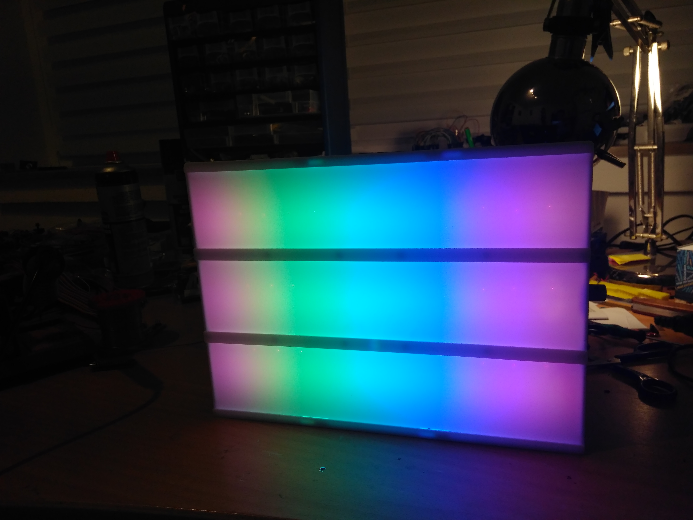

# Fancy-Letter-Box-WS2812B

## This is Repo on how to build a pimped and fancy Letter Box with WS2812B LEDs and Arduino

It all started from a christmas present for 2017. For me it was to boring just to buy a Letter Box, so I consired how to pimp such a Box and came to the point to use WS2812B LEDs wich are controlled from an Arduino Nano. The Power comes from two 2500mAh Li-ion Batteries which are connected parallel. The ATmega on the Arduino is rated 

I bought a normal 30cm x 21cm Letter Box with white LEDS wich are powered over 6 AA-Batteries. Of course you can use bigger or smaller Letter Boxes. Mind that the costs are proportional to the size of the Box. For my Box i payed around 35€ ( 12€ Box + 5€ for 36 LEDs + 10€ for two 2500mAh Li-ion Batteries + 3 € Arduino + 5€ for Potentiometers and Li-ion Charger).

## Needed Components:
- Li-ion batteries ( Two are more then enogh. Playtime > 24 Hours)
  - consider to use 

## Steps:
### 1. Open the Box 
