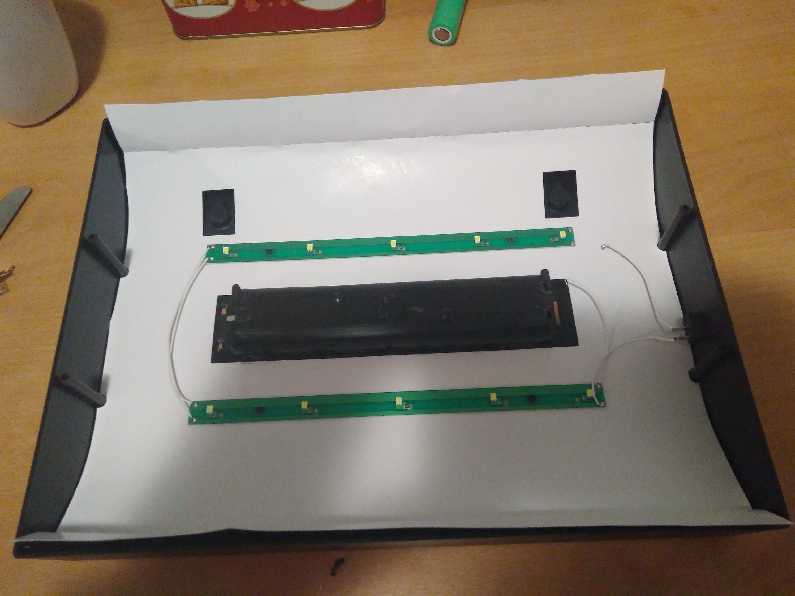
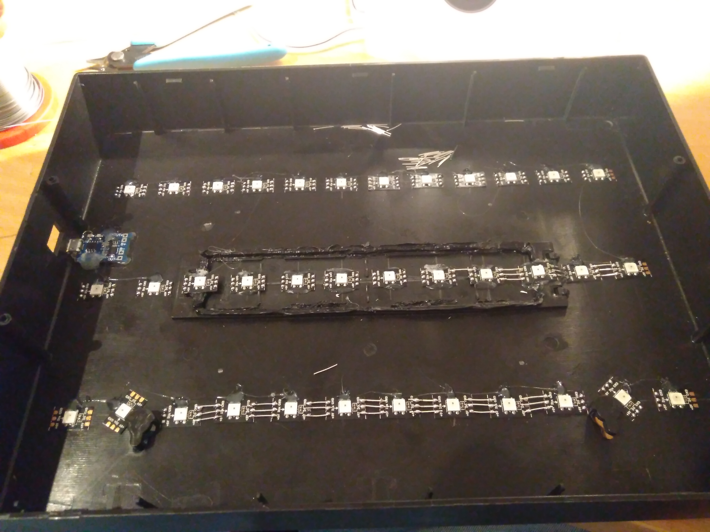
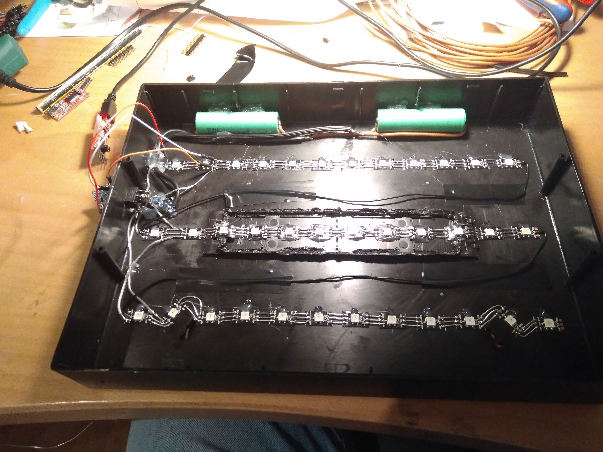
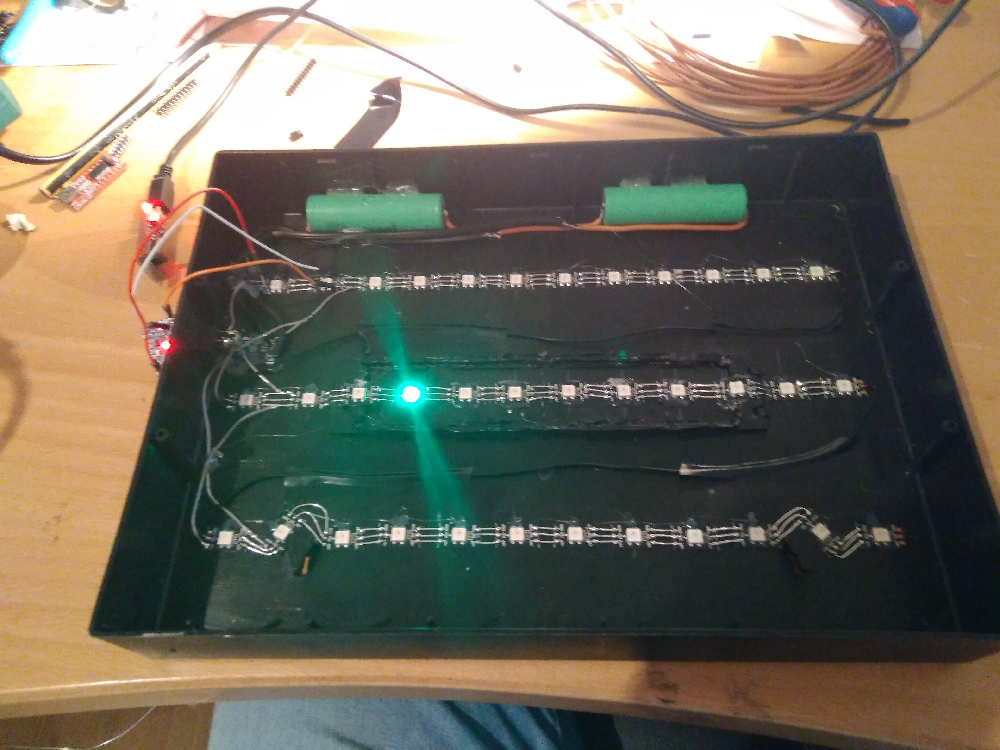
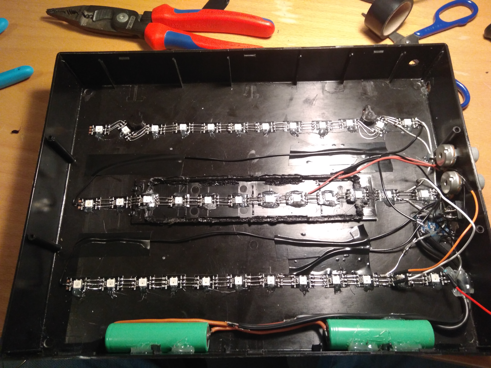

# Fancy-Letter-Box-WS2812B

## This is Repo on how to build a pimped and fancy Letter Box with WS2812B LEDs and Arduino

It all started from a christmas present for 2017. For me it was to boring just to buy a Letter Box, so I consired how to pimp such a Box and came to the point to use WS2812B LEDs wich are controlled from an Arduino Nano. The Power comes from two 2500mAh Li-ion Batteries which are connected parallel. I used [this one](https://www.ebay.de/itm/2-x-Samsung-Li-Ionen-Akku-SDI-INR18650-25R-3-7V-2500mAh-ungesch%C3%BCtzt/172747827130?ssPageName=STRK%3AMEBIDX%3AIT&_trksid=p2057872.m2749.l2649). The ATmega on the Arduino is rated for 2.7V - 5.5V @4Mhz. The only thing you have to do is to bypass the Voltage-Regulator, so the ATmega is powered directly from the Batteries.
The Li-ion are protected and charged with [this Boards](https://www.banggood.com/Upgrade-Version-3_2V3_7V4_2V-USB-Li-ion-Battery-Charger-Module-Board-With-Protected-Function-p-1181098.html?rmmds=search&cur_warehouse=CN) over USB. If you want to control the Brightness and the Speed of the Animations you need two 10k/100kOhm Potentiometers. For switching on and off you can use the built-in Switch from the Box. The Animations are switched by a normal button on the Top of the Box. I recommend to build a simple debounce Circuit or to do this by software. The complete Circuit is shown here:
#### paste circuit design here

Until now i wrote 9 different animations, which can be seen here:
### paste video/gif here

## The 9 Animations are:
- A simple fade through the rainbow
  - Speed and Brightness can be ajdusted
- Fill the whole Box with white
  - Brightness can be adjusted
- A rainbow that fades from left to right
  - Speed and Brightness can be adjusted
- Example Animation from the FastLED Lib with random colored sprinkles
  - Speed and Brightness can be ajdusted
- Example Animation from the FastLED Lib with random colored dots that fade randomly through all LEDs
  - Speed and Brightness can be ajdusted
- Epillepsis Mode just for fun
  - Speed and Brightness can be ajdusted
- Select a Color by rotating one Potentiometer
  - Brightness can be adjusted
- Random selected color that fade into one another
  - Speed and Brightness can be ajdusted
- 3 Areas on the Box with random selected color which fade into one another. Looks very nice on low speeds
  - Speed and Brightness can be ajdusted
  
 #### Over time i will add animations and improve the Code.
  
## Further Ideas:
- Implement Wifi/Bluetooth Module for connection with a Smartphone
- Implement a Mode which switches between all Modes

I bought a normal 30cm x 21cm Letter Box with white LEDS wich are powered over 6 AA-Batteries. Of course you can use bigger or smaller Letter Boxes. Mind that the costs are proportional to the size of the Box. For my Box i payed around 35€ ( 12€ Box + 5€ for 36 LEDs + 10€ for two 2500mAh Li-ion Batteries + 3 € Arduino + 5€ for Potentiometers and Li-ion Charger). You can retain to use the AA-Batteries, but I think this is waste of ressources.

## Needed Components:
- [Li-Ion](https://www.ebay.de/itm/2-x-Samsung-Li-Ionen-Akku-SDI-INR18650-25R-3-7V-2500mAh-ungesch%C3%BCtzt/172747827130?ssPageName=STRK%3AMEBIDX%3AIT&_trksid=p2057872.m2749.l2649) ( Two are more then enogh. Playtime > 24 Hours)
  - I recommend not use no-name "UltraFire" Cells
- [Arduino Nano/Mini/etc...](https://www.banggood.com/5Pcs-ATmega328P-Nano-V3-Controller-Board-For-Arduino-Improved-Version-p-951797.html?rmmds=search)
- [Li-Ion Boards](https://www.banggood.com/Upgrade-Version-3_2V3_7V4_2V-USB-Li-ion-Battery-Charger-Module-Board-With-Protected-Function-p-1181098.html?rmmds=search&cur_warehouse=CN)
- [A Letter Box](https://www.ebay.de/itm/Cinema-30x22-Leuchtbox-Light-Box-Leuchtkasten-Leuchteschild-Buchstaben-Lichtbox/182823286596?ssPageName=STRK%3AMEBIDX%3AIT&_trksid=p2057872.m2749.l2648)
- [WS2812B LEDs](https://www.ebay.de/itm/5m-30-60-144-RGB-LED-Strip-Stripe-mit-WS2812B-5050-SMD-LEDs-WS2812-Versand-au-DE/222192610445?hash=item33bbb62c8d:m:ma7844t_3CDDRZy9uUQJ18w)
  - 36 LEDs for example. I used 3 rows with 12 LEDs.
- Potentiometers, Buttons, Resistors, Thin Cables

## Steps:to 
### 1. Open the Box and remove the original LEDs and Battery Holder.

### 2. Glue the LEDs into the Box and connect them
### 2.1. Make a hole for the USB Connector of the Li-Ion and glue it into place

### 3. Glue the Li-Ion Cells on the bottom of the Box. Pleases put them on the bottom, to prevent tilting of the Box later.
### 3.1. Connect the Batteries, LEDs, switch and the Charger.

### 3.2. Insure that all LEDs are working with a simple Code

### 4. Make Holes in the side of the Box for the two Potentiometers.
### 4.1. Fix the Potentiometer and glue the Arduino into Place.
### 4.2. Finally connect everything and be sure that everything is working by uploading a simple code which uses the two Potentiometers.

### 5. Finally close the Box and you are ready to code your own code or upload my Code. Over time i will add some animations and improve the Code.

